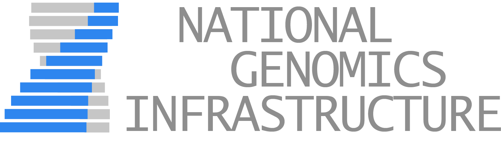

# https://ngisweden.se



### Wordpress theme and plugins for ngisweden.se

> ### Current Status - April 2019
> Under development, running at https://ngisweden-dev.scilifelab.se

## Table of Contents

* [Quick Reference](#quick-reference)
    * [Banner Messages](#banner-messages)
    * [Applications pages](#applications-pages)
    * [Minor things](#minor-things)
* [Content style guide](#content-style-guide)
* [How the website works](#how-the-website-works)
    * [Introduction](#introduction)
        * [WordPress](#wordpress)
        * [Terminology](#terminology)
        * [Plugins and Themes](#plugins-and-themes)
    * [_NGI Sweden_ theme](#ngi-sweden-theme)
        * [Template files](#template-files)
        * [CSS Styles](#css-styles)
        * [Bonus functionality](#bonus-functionality)
        * [WordPress Admin interface](#wordpress-admin-interface)
    * [_NGI Custom Content_ plugin](#ngi-custom-content-plugin)
        * [Post types](#post-types)
        * [Taxonomies](#taxonomies)
        * [Applications](#applications)
        * [Statuses](#statuses)
        * [Publication list](#publication-list)
        * [Homepage application launcher](#homepage-application-launcher)
* [Developing the website code](#developing-the-website-code)
    * [Testing locally](#testing-locally)
    * [Installing the website](#installing-the-website)
    * [Required plugins](#required-plugins)
* [Credits](#credits)


# Quick Reference

These things are non-standard, so Google will not help you.

### Banner Messages

You can add a temporary message at the top of every page in a little coloured box.
This is ideal for adding warnings about limited sample reception, upcoming events or other attention-grabbing short messages.

To add a banner, click _Customise_ in the admin header bar (Appearance > Customise). You can add some text and choose a colour. The box accepts HTML, so you can add a link as follows:

```html
Warning - sample delivery closed for vacations!
<a href="https://website.com/url-address">Click here</a> for more information.
```

Banner messages are shown on every page and are kind of annoying, so use sparingly.

### Applications pages

_Pages_ organised under _Applications_ will not show.
Make them show by linking them to a _Method > Application_ category.

See the [Applications section](##applications) below for more information.

### Minor things

* The interface for adding and editing content recently updated. As such, you might find that older help articles on the web look wrong. See [terminology](#terminology) below for more.
* The NGI Sweden main navigation menu only supports menu items two-deep. If you nest pages any deeper than that, they will be ignored.
* I have removed / disabled a bunch of things in the admin interface to try to simplify the menus. So, Comments, the Theme chooser and various other bits and pieces that you may read about are gone. See [NGI Sweden theme](#ngi-sweden-theme) below for more info.


# Content style guide

Coming soon..

# How the website works

## Introduction

This repository contains the custom code used for the new NGI Sweden website.

### WordPress

The website is built using WordPress.
WordPress began life as a blogging platform way back in 2003, but has since developed in to a fully-fledged _CMS_: a Content Management System. It is now by far the most popular software of its type and some estimates say that around 25% - 33% of all websites on the internet are powered by it ([source](https://w3techs.com/technologies/details/cm-wordpress/all/all)). That's insane! And it's still growing. Check out [this page](https://kinsta.com/wordpress-market-share/) if you're curious.

This huge popularity means:

* There are vast quantities of plugins and help available.
* There are vast numbers of hackers targetting WordPress installations :(

Note the second point - if the site is running for several years, there's a significant risk that it will be hacked at some point.
**Make regular backups**.
By far the easiest way to handle being hacked is to just wipe everything and go back to a backup, then change all passwords.

To avoid confusion, WordPress actually comes in two flavours - `.com` and `.org`:

* https://wordpress.com/ has hosted blog sites for anyone to create.
* https://wordpress.org/ is free software that can be downloaded to run on your own web server.

We are using the second one, so we host on our own server at NGI Stockholm.
WordPress is built in PHP and runs using a MySQL database. You may hear this referred to as a "LAMP stack" - Linux, Apache, MySQL & PHP.

Generally, WordPress.org has excellent documentation. If in doubt, head there for answers.

### Terminology

WordPress has a bunch of jargon that you'll need to be familiar with you find your way around the administration pages of a WordPress site. Here's a brief starter:

* Post
    * The core building-block of most of WordPress, a _Post_ strictly speaking refers to a blog post. On the NGI Sweden I have renamed _Posts_ to _News_ to make this more intuitive. Behind the scenes, most units of content are in WordPress lingo various flavours of posts.
* Page
    * Website pages. Technically, a flavour of _Post_ (see above). Yeah, just a web page really. Not much more to say. Works like you'd expect.
* Custom Post Type
    * Plugins and themes can make their own flavour of post for specific content types. These are called _Custom Post Types_.
* Slug
    * Each Post and Page has a _Slug_. This is the unique, easy-to-parse name for that Page. It's typically used for the page URL. So if the _Slug_ is `awesome-page`, the URL will be https://website.com/awesome-page. If that page is the child of a page with the _Slug_ `iamyourfather`, the URL will be https://website.com/iamyourfather/awesome-page
    * Slugs are auto-generated from Page titles. They must be unique, so if you make two News items called _New Item_, the slugs will be `new-item` and `new-item-2` (I think, or something like this).
    * **You can edit slugs**, but it's not super obvious at first how! Select the main title when editing a Page or Post and you'll see a little box with the URL appear above it. Click on this and it is editable.
    * It's fine to have long titles if you want, but it's nice to have short slugs so that the URL is not ridiculous.
* Permalinks
    * The URLs used for pages. How these are formed can be customised under Settings. Typically it should be set to `/%postname%` - that is, just use the _slug_ (see above).
* Taxonomy
    * General term for WordPress post categories and keywords of all types.
* Editor
    * Where you add and edit content for a Page / Post.
    * NB: This changed very recently, in WordPress v5.0. It's now called the _Gutenberg Editor_  - before becoming part of core WordPress, it was available as a plugin by the same name. Some plugins and pages still use the old editor, which is referred to as the _Classic Editor_.
    * Bear in mind that older stuff you read on the web will look different and not work in the same way because of this change.
* Block
    * In the Gutenberg Editor, content is split up in to _Blocks_. Each block has a certain type - it could be a heading, text, an image or many other things. Some blocks can contain other blocks, for example Columns.
    * Check out the _Settings_ on the right hand side of the editing screen as you click around different block types. The settings available vary between blocks.
* Shortcode
    * To add more complex or dynamic output, WordPress can use _Shortcodes_ in page content. These are like a flag for plugins to insert special content. To use a shortcode, create a shortcode block.
    * Shortcodes are always surrounded by square brackets: `[shortcode]`. They can have _attributes_ to tweak their behaviour. These are separated by an equals sign: `[shortcode key=value]`
* Widget
    * Widgets are a bit like shortcodes, but instead can be placed in specific slots defined by the theme. This is in contrast to shortcodes which are placed in the middle of page content. Again, there are many different types of widgets - many are customisable and plugins often use them.
* Menus
    * WordPress menus are created using a drag-and-drop interface on it's own page.
    * **New pages are not automatically added to menus** - you have to add it yourself. Find it in the boxes on the left and then drag it to the right place.
    * Menu items can be nested arbitrarily, but the NGI Sweden theme only shows the top two levels. Any items deeper that that will be ignored.
    * Most content types can be added to menus, including custom URLs.
* Theme Customiser
    * Although Widgets and Manus have their own administration pages, they can also be edited through the _Theme Customiser_. This is a page where you can make changes and see a live preview of the site update as you do so.
    * A number of aspects of the site can only be edited within the Theme Customiser, so remeber to have a dig there if you're looking for something (eg. banner messages).


### Plugins and Themes

Much of the success of WordPress is due to how easy it is to extend the core feature set.
This is done using _Plugins_ and _Themes_.
Themes are responsible for how the website pages are rendered - how the website looks. Only one theme can be active at any time.
Plugins typically add functionality of some sort and come in all shapes and sizes. You can have many plugins active at any time.

Both plugins and themes use WordPress _hooks_ to work. Every time a visitor loads a page on a WordPress website, the core WordPress software runs through a whole tonne of steps to work out what to do and what it should finally provide as a web page. Each of these steps has a name, called a hook. Custom code can be assigned to each of these hooks to add or modify behaviour.

In addition to modifying core WordPress behaviour with hooks, both Plugins and Themes can add _Shortcodes_, _Widgets_ and _Custom Post Types_.

## NGI Sweden theme

To build the NGI website, I have created a custom WordPress theme from scratch.
It's name is rather uninspiring: `NGI Sweden`.

### Template files

WordPress themes work by using _Template files_ with very specific filenames. WordPress looks for the relevant theme file with decreasing specificity. The final default file is always `index.php`. Check out [wphierarchy.com](https://wphierarchy.com/) and the [WordPress docs](https://developer.wordpress.org/themes/basics/template-hierarchy/) for details.

### CSS Styles

Whilst the template files define how _content_ is printed to the web page, the appearance of that content is defined using CSS in a single file: `wp-content/themes/ngisweden/style.css`. If you want to change a font size, a background colour or add some other tweak - this is where to come.

Note that it is also possible to add custom CSS through the admin interface in the Theme Customiser. **Please do not do this** - there's no good reason to do so, and splitting this stuff up can get super confusing.

### Bonus functionality

In addition to just changing the way that WordPress builds web pages (the "front end"), the theme also creates a few new ways to add content:

* Shortcodes - `[ngisweden_publications]` and `[homepage_applications]`
* Widgets - `NGI Footer Logos` and `NGI Footer Social Buttons`
* Banner Messages in the Theme Customiser.

See the [Quick Reference](#quick-reference) section at the top for instructions on what these do and how to use them.

### WordPress Admin interface

I removed a bunch of stuff from the WordPress admin interface to try to clean it up and simplify it. Notably, both _Comments_, the _Theme chooser_ are gone from the menu. You can still access these pages if you visit the URL directly:

*  Theme chooser: `/wp-admin/themes.php`
*  Theme editor: `/wp-admin/theme-editor.php`
*  Plugin editor: `/wp-admin/plugin-editor.php`
*  Discussion (Comments): `/wp-admin/options-discussion.php`

I also removed items from the admin top bar, the admin dashboard and a bunch of other stuff. Have a look at `wp-content/themes/ngisweden/functions/admin_ui.php` to modify this behaviour.

## NGI Custom Content plugin

Whilst I could have added all of the new functionality just in to the theme, I chose to also make a Plugin. This is so that if we want to update the visual identify of the website in the future by switching to a new theme, we won't lose all of our page content that we've lovingly written.

### Post types

The NGI Custom Content plugin adds two _Custom Post Types_ - `Methods` and `Bioinformatics`. By keeping these separate from _Pages_, we can do clever things with the way that they are displayed and capture extra information in custom fields.

### Taxonomies

Both of these post types share several _Taxonomies_ to help to categorise them - `Applications`, `Sequencing Types`, `Statuses` and `Keywords`. The first three are _hierarchical_ - that is, they behave as categories that can be nested within one another. Keywords are not hierarchical, and behave more like flat labels or tags.

Every method or bioinformatics page should be assigned to all of these taxonomies.

> **If a Method or Bioinformatics page is not assigned to an Application, it will not be visible on the website!**

### Applications

Applications have additional special fields: _Application Page_ and _Application Icon_.

It's difficult to have rich formatted content for a taxonomy, so to get around this we just write a short description and then link to a _Page_. This should be nested under the page called _Applications_. I realise that this is kind of confusing, sorry.

Note that any _Page_ added as a child of the one called _Applications_ will not be viewable on the website. This is because the _Method_ categories is called `applications`, so the URL clashes. This is kind of intended, as any pages there should be linked to from the relevant application taxonomy.

The _Application Icon_ allows you to customise the icon used on the homepage for the given application. NB: This is only used for top-level applications. To use this, click the link _Click here to find icon URLs_ next to the field to open a new page. This has tonnes of nice icons, along with a search bar. Find one that you like and click it to reveal some text that shoud look something like this:

```
includes/icons/fontawesome-svgs/regular/smile-wink.svg
```

Copy this text in to the _Application Icon_ field and save. It should now be used on the homepage. If left blank or not found, the homepage will default to showing a little conical flask icon.

### Statuses

Statuses are used to show whether an application is high throughput and used in production or still in development. Again, there are two special fields: _Status Colour_ and _Status Icon_. The colour is pretty self-explanitory and the icon works exactly as above for the the _Application Icon_.

These are used to customise the little badge that appears on methods of that status.


### Publication list
Use the following shortcode:
```
[ngisweden_publications]
```

Arguments:
* `title` - Show or hide the title above the list
    * `0` to disable, `1` to enable. Default: `1`
* `randomise` - Randomise the list, or show the most recent
    * `0` to leave sorted, `1` to randomise. Default: `1`
* `num` - Number of publications to show in the list
    * Any number. Default `5`
* `collabs` - _Minimum_ number of publications that should be collaborations
    * Any number. Default `0`
    * If >= `num`, will show only collabs.
    * If fewer collabs than `num` exist, list will be shorter than `num`

For example, to show a sorted list with the 10 latest collaboration papers and no title:
```
[ngisweden_publications title=0 randomise=0 num=10 collabs=10]
```

### Homepage application launcher
Shows the search bar and large blue buttons for the top-level method application categories.

Use the following shortcode (there are currently no options):

```
[homepage_applications]
```

# Developing the website code

> **Main repository: https://github.com/NationalGenomicsInfrastructure/ngisweden.se**

The website code should be developed in the same way that we do everything - find the repository on GitHub and fork it to your personal account. Make your changes and submit as a pull-request, then deploy.

For deployment instructions, ask Phil, Remi or Johannes. At some point we should probably describe the process in AM Systems or something.

## Testing locally

You should always test the website locally before making changes. To do this, you'll need to run your own installation of all of the code. You only need to set this up once..

1. Assuming that you're using a Mac, get a copy of [MAMP](https://www.mamp.info/en/) (the free version is fine)
2. Open MAMP and open the preferences (Menu > MAMP > Preferences, or `cmd`+`,`). Go to the _Web Server_ tab and select the directory where you have cloned the repository.
3. Hit _Start Servers_ - it should think for a moment then launch a web page. Click _My Website_ in the top menu. This will launch another new tab where you can see your development web server running! :tada:
4. Install WordPress - see section below.
  * I'm now assuming that you're now looking at a similar looking, if fairly empty web page
5. Export content from the live website: _Tools_ > _Export_ > _All Content_
6. Import this content to your local website: _Tools_ > _Import_ > _WordPress_ > _Run Importer_
7. That's it! You should now have a working local copy of the NGI website which you can tinker with to your heart's content. Next time, just pull the latest code and run MAMP.

## Installing the website

Only the custom code written specifically for the NGI website is kept in this repository.
When setting up locally or deploying on a new server, you need to get copies of everything else. These are the steps you need to do:

1. [Download WordPress](https://wordpress.org/download/) from wordpress.org and extract the files where you want to run the site
2. Make a subfolder and clone your fork of this website repository.
3. Carefully move **all** of these files in to the main WordPress directory structure, being careful not to overwrite any existing directories.
    * Make sure that you also move the `.git` directory and all hidden files
    * If you prefer, you can do it the other way around - moving the WordPress files in to your cloned repository. Doesn't matter which way around this happens.
4. Check that `git status` is still clean
    * The bundled `.gitignore` file should ignore all core WordPress files, so running `git status` should look the same as when you first cloned.
5. Run the web server / go to the web page. You should see instructions for setting up WordPress with a MySQL database. Follow these instructions. _All right, sparky!_
6. When finished, you should have a functioning through pretty empty looking website. Log in by going to `/wp-login.php` or `/wp-admin/` (there should be a link in the footer).
7. In the admin interface, go to _Plugins_ > _Add New_ and install the plugins listed below.
    * Make sure you activate the plugins that you install. You will also need to activate the _NGI Custom Content_ plugin that comes in this repository.
8. That should be it! Now it's just a case of adding content (see above section).

## Required plugins

> WordPress version >= 5.1 is required for the NGI Sweden website.

Probably more plugins to come, but this is correct at the time of writing.

### Hard requirements

This plugins are directly used by the theme code, the site may break or do weird things without them.

| Plugin Name               | Minimum Version | URL | Description |
|---------------------------|-----------------|-----|-------------|
| Ajax Search Lite          | v4.7.25         | https://wordpress.org/plugins/ajax-search-lite/ | Used for the search bar on the homepage and top navigation, shows dynamic results as you type. |
| CPT Bootstrap Carousel    | v1.10           | https://wordpress.org/plugins/ajax-search-lite/ | Used for the image slider / carousel on the homepage. Also written by Phil, a long long time ago. |
| Events Manager            | v5.9.5          | https://wordpress.org/plugins/events-manager/ | Used to manage upcoming events on the website |

### Soft Requirements

These plugins make minor non-essential additions to the website, add minor functionality or affect the admin user interface to make life easier.
The website should still work basically fine without them, but they're good to have.

| Plugin Name               | Minimum Version | URL | Description |
|---------------------------|-----------------|-----|-------------|
| All In One WP Security & Firewall | v4.3.8.3 | https://wordpress.org/plugins/all-in-one-wp-security-and-firewall/ | Does a bunch of security hardening to try to lower our chances of being hacked. |
| Broken Link Checker       | v1.11.8         | https://wordpress.org/plugins/broken-link-checker/ | Adds an admin page and a admin-dashboard box warning you about in-page URLs that are broken. |
| Fancy Admin UI            | v2.1            | https://wordpress.org/plugins/fancy-admin-ui/ | Provides major re-styling to the admininstation interface. I think it looks nicer, but feel free to disable it if it gets buggy or annoying. |
| GDPR Cookie Consent       | v1.7.6          | https://wordpress.org/plugins/cookie-law-info/ | Adds the annoying little bar along the bottom warning about cookies. |
| Post Types Order          | v1.9.3.9        | https://wordpress.org/plugins/post-types-order/ | Adds an admin interface for each post type that allows drag-and-drop reordering of posts. |


# Credits

This website code was written by Phil Ewels ([@ewels](http://github.com/ewels/)) in a frenzied rush before going on paternity leave in March / April 2019.
